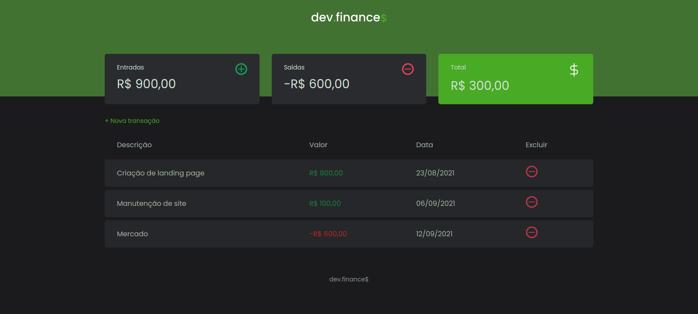

<p align="center">
	
</p>

# 

## O que é o devfinances?

O devfinances é uma aplicação web simples para gerenciar seus ganhos e despesas.

Este projeto foi desenvolvido durante a **[Primeira Maratona Discover](https://app.rocketseat.com.br/node/maratona-discover-edicao-01)**, uma maratona voltada para devs iniciantes, realizada pela **[Rocketseat](https://github.com/Rocketseat)**, sendo essa edição focada em desenvolvimento front-end e com as aulas sendo gravadas pelo **[Mayk Brito](https://github.com/maykbrito)**.

## Diferenciais

Este projeto tem algumas diferenças em relação à aplicação desenvolvida originalmente durante a maratona, sendo as principais delas:

- Separação dos arquivos JavaScript em módulos;
- Utilização de Webpack para gerar um código mais otimizado e compatível com navegadores mais antigos;
- Utilização de Sass para uma melhor experiência de desenvolvimento com CSS;
- Dark mode por padrão;

## Executando o projeto

Clone o projeto e acesse sua respectiva pasta.

```bash
git clone https://github.com/guilhermesdev/devfinances.git
cd devfinances
```

Instale as dependências do projeto

```bash
yarn install

# ou

npm install
```

E então execute o seguinte script para rodar em modo de desenvolvimento:

```bash
yarn start

# ou

npm run start
```

Ou o script a seguir para realizar o processo de build e gerar a versão para produção:

```bash
yarn build

# ou

npm run build
```